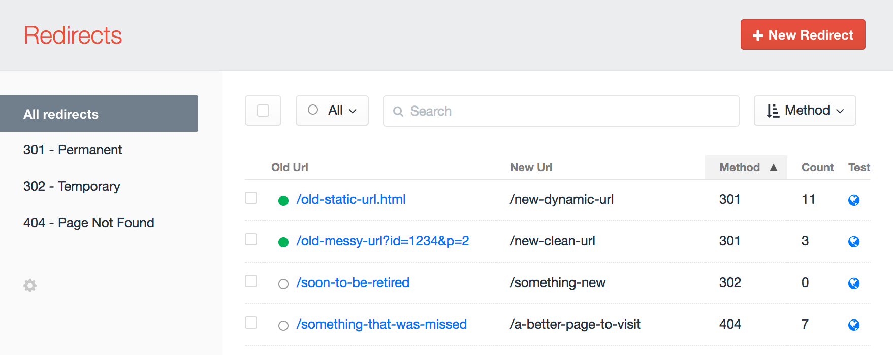
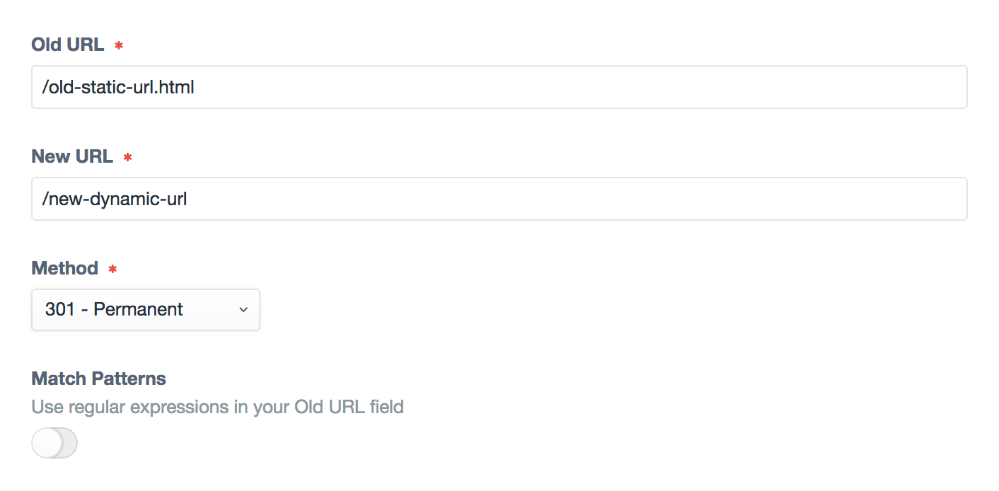
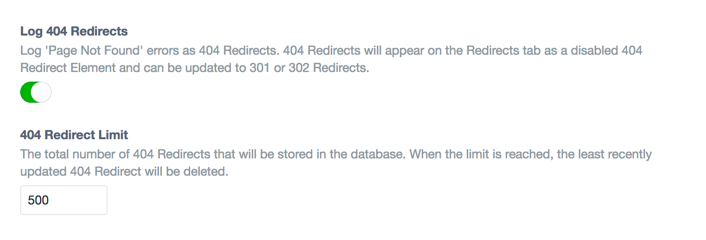

# Redirects

Redirects allow you to forward users and search engines to the appropriate content on your site. Redirects can be managed on a per-site basis directly in the Control Panel.



Sprout SEO supports 3 types of Redirects:

| Type | Description |
|:-------------:|:----------- |
| **301** | Redirect content that has permanently moved to a new location |
| **302** | Redirect content that has temporarily moved to a new location |
| **404** | Captures a 404 request and allows you to manually convert the URL that is 404ing into a 301 or 302 redirect. |

## Redirect Settings

Each Redirect has 4 settings, tracks the count of how many times it was used, and can be enabled or disabled.



| Setting          | Description |
|:---------------- |:----------- |
| **Old&nbsp;URL** | The URL where your content used to live |
| **New&nbsp;URL** | The URL where your content will live in the future |
| **Method** | Indicate to search engines whether the redirect behavior is permanent or temporary |
| **Match&nbsp;Patterns&nbsp;(optional)** | Enables additional checks to process more advanced patter matching in the redirects using regular expressions |

## Bulk Actions

Redirects can be updated via bulk actions by selecting the checkboxes next to each Redirect on the Redirect listing page. Currently supported bulk actions include: 

- Update Status to Enabled
- Update Status to Disabled
- Update Method to 301
- Update Method to 302
- Edit (if only one item is selected)
- Delete

## Regular Expressions

Redirect multiple URLs with a similar pattern by selecting the **Match Patterns** option. When the Match Patterns option is selected, you can then use _Regular Expressions_ in the Old URL field and reference _Capture Groups_ in the New Url field.

| Old Url - Regular Expressions    | New Url - Capture Groups    |
|:-------------------------------- |:--------------------------- |
| /old-location/(.*)               | new-location/$1             |
| /old-location/(\d{4})/(\d{2})    | new-location/$1/$2          |

## Order of Redirects

Redirects can be re-ordered via drag and drop when ordered by the `Structure` option on the Redirect listing page.

Redirects are processed from top to bottom as they are seen in the Structure view. If two or more redirects match a URL, the highest on the list will be the one that takes priority in how a particular URL is redirected.

Redirects are not processed until Craft tries all other Routing options. When a page is about to 404, Sprout SEO will then check to see if a URL matches a Redirect rule and route things accordingly. This takes place between step 5 and 6 of Craft's [Routing](https://craftcms.com/docs/routing) rules.  Waiting until the last moment allows you to optimize your website experience and page speed for the majority of your users while still helping redirect any people attempting to access old URLs to the right place.

## 404 Redirects

To monitor and capture 404 Redirects, you will need to enable them in your Sprout SEO settings: _Settings->General->Log 404 Redirects_.



404 Redirects will get created with a disabled status and a default redirect location to your home page. 

404 Redirects will need to be reviewed and manually updated to choose a redirect method (301 or 302), a redirect location, and be enabled.

You can view all 404 Redirects on the Redirects tab using the filter in the sidebar for '404 - Page Not Found'.

## Importing Redirects

Sprout Import provides a Sprout SEO Redirect import utility that can help you convert a spreadsheet of Redirects into a JSON format that can be imported with Sprout Import.

To use this feature:

1) Create a spreadsheet of your redirects with 5 columns:

- oldUrl (relative url)
- newUrl (relative url)
- method (301, 302, 404)
- regex (1 or 0)
- count (0)

2) Create a sixth column to combine all of your Redirect values into a comma-separated list:

```
oldUrl, newUrl, method, regex, count
```

3) Copy and paste your list of comma-separated redirects into the Sprout Import SEO Helper utility

```
/old-url, /new-url, 301, 0, 0
/another-old-url, /another-new-url, 302, 0, 0
/retired-section(.*), /new-section, 301, 1, 0
```

4) Select "Generate JSON" and copy the output to the `Sprout Import->Import` tab `Import via Copy/Paste` field.

## Additional Notes

### 301 vs 302 Redirects

When you create a Redirect for the first time, it's often best to create it as a 302 redirect, test it, and then update it to be a 301 Redirect.

A 301 Redirect gets cached in a visitors browser. The only way to clear the cache of a visitors browser is to ask them to go into their browser and clear their cache. In the case that you publish an incorrect 301 redirect, you could run into a scenario where 100s of visitors to your site get the wrong URL cached in their browser. Even if you correct the redirect, each one of those users will need to clear their browser cache before the old URL they are trying to access will see your updated Redirect. By testing your Redirects as 302 Redirects first, you reduce the risk that your users will get incorrect URLs cached in their browsers.

Sprout SEO provides a bulk Element Action where you can update a group of Redirects from 302 Redirects to 301 Redirects after testing.

### Redirects not handled by Sprout SEO

Sprout SEO allows you to manage redirects for any page that could result in a 404. In a few edge cases, there can be a scenario where Craft processes a request and does not throw a 404 for a URI that you wish to Redirect. In these scenarios, we currently recommend handling these types of Redirects outside of Sprout SEO using .htaccess, the `` tag, or some other method.